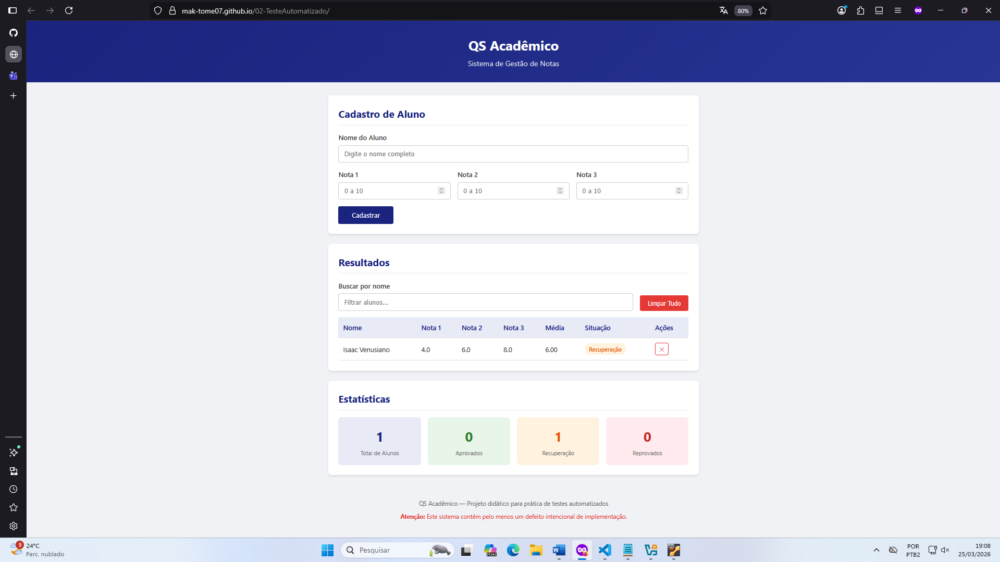
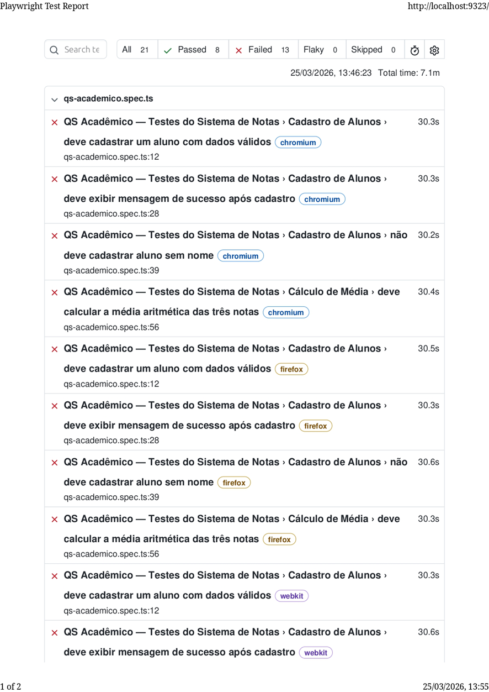
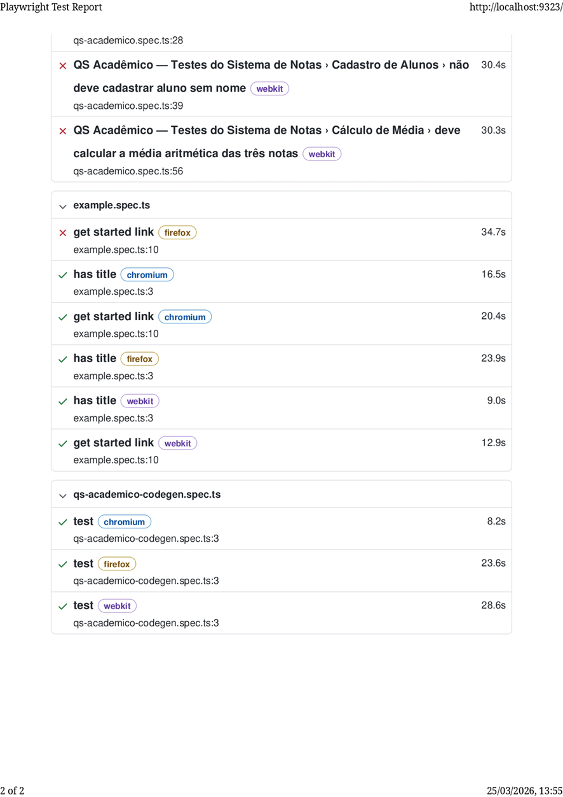
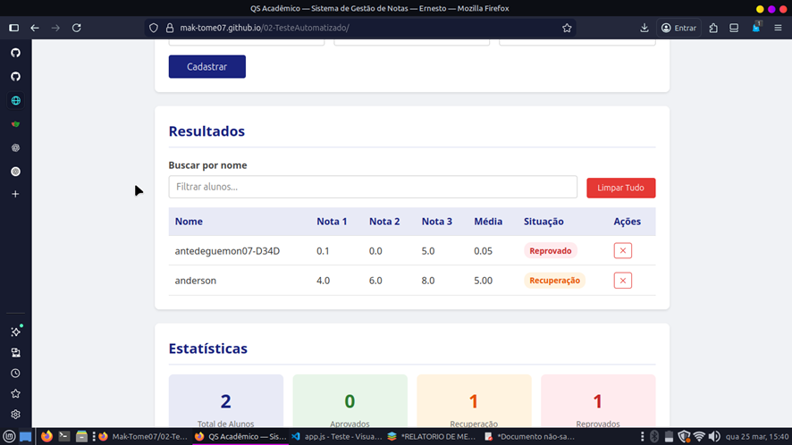
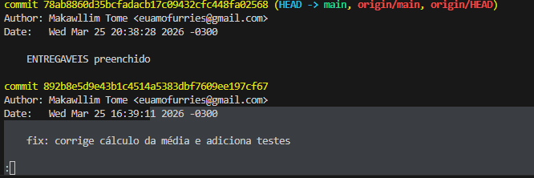
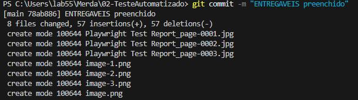

# Documento de Entregáveis — Automação de Testes com Playwright

**Aluno(a):** _(Makawllim Tomé de Jesus)_  
**Dupla (se aplicável):** _(Rafael Ferreira Penna dos Santos)_  
**Data:** 25/03/2026  
**Repositório (fork):** `https://github.com/Mak-Tome07/02-TesteAutomatizado`  
**GitHub Pages:** `https://mak-tome07.github.io/02-TesteAutomatizado/`

---

## Entregável 1 — Fork do Repositório e GitHub Pages

| Item | Valor |
|------|-------|
| **URL do fork no GitHub** | `https://github.com/Mak-Tome07/02-TesteAutomatizado/` |
| **URL do site no GitHub Pages** | `https://mak-tome07.github.io/02-TesteAutomatizado/` |
| **Site está acessível e funcional?** | ✅ Sim / ☐ Não |

**Evidência:** _()_

---

## Entregável 2 — Projeto Playwright com Testes

### 2.1 Teste gerado pelo Codegen

| Item | Detalhes |
|------|----------|
| **Arquivo** | `testes-playwright/tests/qs-academico-codegen.spec.ts` |
| **Ações gravadas** | ✅ Cadastro de "Ana Silva" (8, 7, 9) |
|                     | ✅ Cadastro de "Carlos Lima" (5, 4, 6) |
|                     | ✅ Busca por "Ana" |
|                     | ✅ Exclusão do segundo aluno |
| **Teste executa com sucesso?** | ✅ Sim / ☐ Não |

**Reflexão sobre o Codegen:** _(Que tipo de seletores o Codegen utilizou? São os mais indicados? Justifique.)_

> _(O Codegen utilizou predominantemente seletores baseados em acessibilidade, especialmente getByRole com o atributo name, além de um uso pontual de getByText. Isso significa que ele está localizando elementos com base em seus papéis semânticos (roles ARIA) — como textbox, spinbutton e button — combinados com os rótulos visíveis ao usuário, o que é, em geral, uma das abordagens mais recomendadas no Playwright por priorizar robustez e proximidade com a experiência real do usuário. No entanto, há um problema: apesar de os seletores por role serem adequados, o Codegen gerou interações redundantes (vários .click() antes de .fill()) e introduziu um seletor frágil com getByText('Resultados Buscar por nome'), que pode causar ambiguidade ou falhas se o texto mudar ou aparecer em múltiplos contextos. Além disso, o uso de nomes dinâmicos como 'Excluir Carlos Lima' pode quebrar facilmente se o conteúdo variar. Ou seja, os seletores são conceitualmente bons (alto nível, acessíveis e resilientes), mas a implementação automática ainda exige refinamento manual para evitar fragilidade, redundância e dependência excessiva de texto literal.
 )_

### 2.2 Testes escritos manualmente

| Item | Detalhes |
|------|----------|
| **Arquivo** | `testes-playwright/tests/qs-academico.spec.ts` |

**Checklist dos testes implementados:**

| # | Teste | Implementado | Passa? |
|---|-------|:------------:|:------:|
| 1 | Cadastrar aluno com dados válidos | ✅ | ✅ Sim / ☐ Não |
| 2 | Exibir mensagem de sucesso após cadastro | ✅ | ✅ Sim / ☐ Não |
| 3 | Rejeitar cadastro sem nome | ✅ | ✅ Sim / ☐ Não |
| 4 | Calcular a média aritmética das três notas | ✅ | ☐ Sim / X Não |
| 5 | Validação de notas fora do intervalo (0–10) | ✅ | ✅ Sim / ☐ Não |
| 6 | Busca por nome (filtro) | ✅ | ✅ Sim / ☐ Não |
| 7 | Exclusão individual de aluno | ✅ | ✅ Sim / ☐ Não |
| 8 | Estatísticas (totais por situação) | ✅ | ✅ Sim / ☐ Não |
| 9 | Situação — Aprovado (média ≥ 7) | ✅ | ✅ Sim / ☐ Não |
| 10 | Situação — Reprovado (média < 5) | ✅ | ✅ Sim / ☐ Não |
| 11 | Situação — Recuperação (média ≥ 5 e < 7) | ✅ | ✅ Sim / ☐ Não |
| 12 | Múltiplos cadastros (3 alunos → 3 linhas) | ✅ | ✅ Sim / ☐ Não |

---

## Entregável 3 — Relatório HTML do Playwright

### 3.1 Relatório ANTES da correção do defeito

**Evidência:** _()_

| Métrica | Valor |
|---------|-------|
| **Total de testes** | 28 |
| **Testes aprovados (passed)** | 8 |
| **Testes reprovados (failed)** | 13 |
| **Navegadores testados** | Chromium, Firefox, Webkit |

### 3.2 Relatório DEPOIS da correção do defeito

**Evidência:** _()_

| Métrica | Valor |
|---------|-------|
| **Total de testes** | 27 |
| **Testes aprovados (passed)** | 24 |
| **Testes reprovados (failed)** | 3 |
| **Navegadores testados** | Chromium, Firefox, Webkit |

---

## Entregável 4 — Registro do Defeito Encontrado

| Campo | Descrição |
|-------|-----------|
| **Título do defeito** | _(ex: "Cálculo da média ignora a terceira nota")_ |
| **Severidade** | ☐ Crítica / ✅ Alta / ☐ Média / ☐ Baixa |
| **Componente afetado** | _(ex: função `calcularMedia` em `docs/js/app.js`)_ |
| **Passos para reproduzir** | 1. _(Acessar o sistema)_ |
|                            | 2. _(Cadastrar aluno com notas 4, 6 e 8)_|
|                            | 3. _(Observar o valor da média exibida)_ |
| **Resultado esperado** | _(A média deve ser (4 + 6 + 8) / 3 = 6.00)_ |
| **Resultado obtido** | _(O sistema exibe 5.00)_ |
| **Teste(s) que revelaram o defeito** | _(Teste automatizado falhando (toHaveText('8.00') vs 7.00))_ |
| **Evidência visual** | _()_ |

### Análise do Trace Viewer

| Aspecto | Observação |
|---------|------------|
| **Em qual asserção o teste falhou?** | |
| **Valor esperado** | |
| **Valor obtido** | |
| **Screenshot do momento da falha** | _(inserir)_ |

### Exemplo de cálculo demonstrando o defeito

| Notas inseridas | Média esperada (correta) | Média exibida (com defeito) | Diferença |
|:---------------:|:------------------------:|:---------------------------:|:---------:|
| N1=\_\_, N2=\_\_, N3=\_\_ | | | |
| N1=\_\_, N2=\_\_, N3=\_\_ | | | |
| N1=\_\_, N2=\_\_, N3=\_\_ | | | |

---

## Entregável 5 — Correção do Defeito

| Item | Detalhes |
|------|----------|
| **Arquivo corrigido** | `docs/js/app.js` |
| **Função corrigida** | _(function calcularMedia)_|
| **Código original (com defeito)** | _(function calcularMedia(nota1, nota2, nota3) {return (nota1 + nota2) / 2;})_ |
| **Código corrigido** | _(function calcularMedia(nota1, nota2, nota3) {return (nota1 + nota2 + nota3) / 3; //CORRIGIDO})_ |
| **Hash do commit** |  |
| **Mensagem do commit** |  |

**Validação pós-correção:**

- ✅ Todos os testes passam após a correção
- ✅ O site no GitHub Pages foi atualizado (commit + push)
- ✅ O relatório HTML mostra 100% de aprovação

---

## Checklist Final de Entrega

| # | Entregável | Concluído |
|---|------------|:---------:|
| 1 | Fork do repositório + GitHub Pages funcionando | ✅ |
| 2 | Projeto Playwright com todos os testes (`qs-academico.spec.ts` e `qs-academico-codegen.spec.ts`) | ✅ |
| 3 | Screenshots/PDF do relatório HTML (antes e depois da correção) | ✅ |
| 4 | Registro do defeito encontrado (preenchido acima) | ✅ |
| 5 | Commit com a correção do defeito em `docs/js/app.js` | ✅ |
